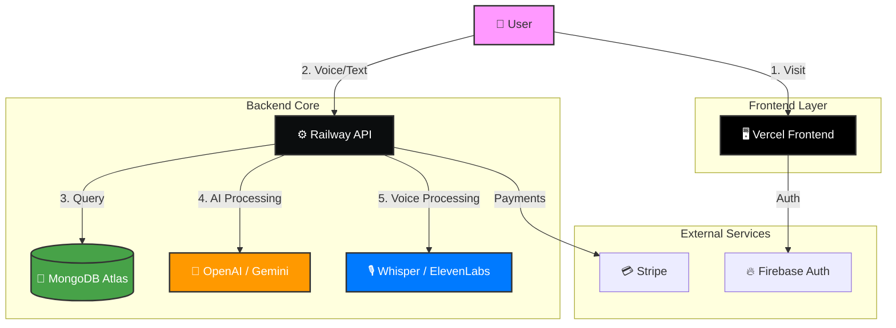

# 🧠 EaseMind - Digital Emotional Support Platform


[](https://easemind.io)
[](LICENSE)
[](https://github.com/adriancantero-stack/easemind-app)
[](https://www.typescriptlang.org/)
[](https://www.python.org/)
[](https://www.mongodb.com/)

> **Calm your mind, heal your day** - An AI-powered mental wellness platform offering emotional support, guided sessions, mood tracking, and crisis intervention.

## 🌟 Overview

EaseMind is a comprehensive mental health application featuring:
- 🤖 **Luna AI Therapist** - Empathetic AI companion powered by OpenAI/Google Gemini
- 🎙️ **Voice Interaction** - Speech-to-text and text-to-speech capabilities
- 📊 **Mood Tracking** - Monitor emotional patterns over time
- 🧘 **Guided Sessions** - Meditation, breathing exercises, and mindfulness
- 📔 **Emotional Diary** - Private journal with AI insights
- 🚨 **Crisis Support** - Automatic risk detection and emergency resources
- 💎 **Premium Plans** - Subscription management via Stripe

## 🏗️ Architecture

<div align="center">



</div>

## 🚀 Live Deployment

| Service | URL | Status |
|---------|-----|--------|
| **Website** | [easemind.io](https://easemind.io) | 🟢 Active |
| **API** | [api.easemind.io](https://api.easemind.io) | 🟢 Active |
| **Pre-sell (PT)** | [easemind.io/pt/educativo](https://easemind.io/pt/educativo) | 🟢 Active |
| **Pre-sell (EN)** | [easemind.io/en/educational](https://easemind.io/en/educational) | 🟢 Active |
| **Pre-sell (ES)** | [easemind.io/es/educativo](https://easemind.io/es/educativo) | 🟢 Active |
| **Admin** | [easemind.io/admin](https://easemind.io/admin) | 🔒 Protected |

## ✨ Features

### Core Functionality

#### 💬 Chat with Luna
- AI-powered emotional support in 3 languages (PT, EN, ES)
- Context-aware conversations with memory
- Automatic risk detection for crisis intervention
- Personalized responses based on user history

#### 🎙️ Voice Capabilities
- **Speech-to-Text**: Whisper API integration
- **Text-to-Speech**: ElevenLabs & OpenAI voices
- Natural conversation flow

#### 📊 Mood & Wellness Tracking
- Daily mood logging (1-5 scale)
- Trend analysis and insights
- Correlation with activities and techniques

#### 🧘 Guided Sessions
- Meditation exercises
- Breathing techniques (4-7-8, Box Breathing)
- Grounding exercises (5-4-3-2-1)
- Progress tracking and statistics

#### 📔 Emotional Diary
- Private journal entries
- AI-powered insights and reflections
- Search and filter capabilities
- Export functionality

#### 🚨 Crisis Support (SOS)
- Automatic keyword detection
- Immediate emergency resources
- Crisis hotline information
- Event logging for safety

#### 💎 Premium Plans
- **Free Tier**: Basic features
- **Premium Monthly**: Full access ($9.99/month)
- **Premium Yearly**: Best value ($99/year)
- **7-Day Free Trial**: Try premium risk-free

### Admin Features

- 📈 Real-time analytics dashboard
- 👥 User management
- 💳 Subscription management
- 📊 Interactive charts (Chart.js)
- 🔍 Search and filters
- 📥 Data export

## 🛠️ Tech Stack

### Frontend
- **Framework**: Express.js (Node.js)
- **Styling**: Custom CSS with modern design system
- **Authentication**: Firebase Auth
- **Deployment**: Vercel (automatic)

### Backend
- **Framework**: FastAPI (Python 3.11)
- **AI/ML**: OpenAI GPT-4, Google Gemini
- **Voice**: Whisper, ElevenLabs
- **Database**: MongoDB (Motor async driver)
- **Payments**: Stripe
- **Deployment**: Railway (Docker)

### Infrastructure
- **Hosting**: Vercel (Frontend) + Railway (Backend)
- **Database**: MongoDB Atlas
- **CDN**: Vercel Edge Network
- **SSL**: Automatic HTTPS

## 📦 Installation

### Prerequisites
- Node.js 18+
- Python 3.11+
- MongoDB
- Git

### Local Development

1. **Clone the repository**
   ```bash
   git clone https://github.com/adriancantero-stack/easemind-app.git
   cd easemind-app
   ```

2. **Configure environment variables**
   ```bash
   cp env.example .env
   ```
   
   Fill in the required values:
   ```env
   # MongoDB
   MONGO_URL=mongodb+srv://...
   
   # OpenAI
   OPENAI_API_KEY=sk-...
   
   # Firebase
   FIREBASE_CREDENTIALS={"type":"service_account",...}
   
   # Stripe
   STRIPE_SECRET_KEY=sk_test_...
   STRIPE_WEBHOOK_SECRET=whsec_...
   
   # ElevenLabs
   ELEVENLABS_API_KEY=...
   ```

3. **Install dependencies**
   ```bash
   # Backend
   cd backend
   pip install -r requirements.txt
   
   # Website
   cd ../website
   npm install
   ```

4. **Run locally**
   ```bash
   # Backend (Terminal 1)
   cd backend
   uvicorn server:app --reload --port 8001
   
   # Website (Terminal 2)
   cd website
   npm run dev
   ```

5. **Access locally**
   - Website: http://localhost:9000
   - API: http://localhost:8001
   - API Docs: http://localhost:8001/docs

## 🚀 Deployment

### Automatic Deployment

This project uses **automatic deployment**:

- **Frontend**: Vercel deploys automatically on push to `main` branch
- **Backend**: Railway deploys automatically on push to `main` branch

### Manual Deployment

#### Vercel (Frontend)
```bash
cd website
vercel --prod
```

#### Railway (Backend)
```bash
# Railway CLI
railway up

# Or via Docker
docker build -t easemind-backend .
docker run -p 8001:8001 easemind-backend
```

## 📁 Project Structure

```
easemind-app/
├── backend/                    # FastAPI backend
│   ├── server.py              # Main API server (78 endpoints)
│   ├── orchestrator.py        # Memory & risk management
│   ├── requirements.txt       # Python dependencies (15 packages)
│   └── Dockerfile             # Docker configuration
├── website/                    # Express.js website
│   ├── server.js              # Web server
│   ├── admin.html             # Admin dashboard
│   ├── educativo.html         # Pre-sell page
│   ├── locales/               # Translations (PT/EN/ES)
│   └── public/                # Static assets
├── Dockerfile                  # Backend Docker image
├── railway.json               # Railway configuration
└── README.md                  # This file
```

## 🔐 Environment Variables

### Backend (Railway)

| Variable | Description | Required |
|----------|-------------|----------|
| `MONGO_URL` | MongoDB connection string | ✅ |
| `OPENAI_API_KEY` | OpenAI API key | ✅ |
| `FIREBASE_CREDENTIALS` | Firebase service account JSON | ✅ |
| `STRIPE_SECRET_KEY` | Stripe secret key | ✅ |
| `STRIPE_WEBHOOK_SECRET` | Stripe webhook secret | ✅ |
| `ELEVENLABS_API_KEY` | ElevenLabs API key | ⚠️ Optional |
| `PORT` | Server port (default: 8001) | ⚠️ Optional |

### Frontend (Vercel)

| Variable | Description | Required |
|----------|-------------|----------|
| `BACKEND_URL` | Backend API URL | ✅ |
| `FIREBASE_ADMIN_SDK` | Firebase Admin SDK JSON | ✅ |
| `MONGO_URL` | MongoDB connection string | ✅ |

## 📊 API Endpoints

### Core Endpoints

```
GET  /                          # API info
GET  /api/health                # Health check
GET  /api/version               # Version info

POST /api/chat                  # Chat with Luna
POST /api/transcribe            # Speech-to-text
POST /api/tts                   # Text-to-speech

POST /api/mood                  # Log mood
GET  /api/mood-trend/{user_id}/{days}  # Mood trends

POST /api/session               # Log session
GET  /api/sessions/{user_id}    # Get sessions

POST /api/journal               # Create journal entry
GET  /api/journal/{user_id}     # Get journal entries

POST /api/sos/trigger           # Trigger SOS
GET  /api/sos/contacts/{user_id}  # Emergency contacts
```

### Admin Endpoints

```
GET  /api/admin/stats           # Dashboard stats
GET  /api/list_users            # List all users
DELETE /api/admin/delete-user/{uid}  # Delete user
GET  /api/admin/subscriptions   # List subscriptions
PUT  /api/admin/subscription/{user_id}  # Update subscription
```

### Stripe Endpoints

```
POST /api/stripe/create-checkout  # Create checkout session
POST /api/stripe/webhook          # Stripe webhook handler
GET  /api/stripe/subscription-status/{email}  # Check subscription
```

Full API documentation: [api.easemind.io/docs](https://api.easemind.io/docs)

## 🧪 Testing

### Backend Tests
```bash
cd backend
pytest
```

### API Testing
```bash
# Health check
curl https://api.easemind.io/api/health

# Version
curl https://api.easemind.io/api/version

# Chat (requires auth)
curl -X POST https://api.easemind.io/api/chat \
  -H "Content-Type: application/json" \
  -d '{"message":"Hello","user_id":"test","lang":"en"}'
```


## 📈 Performance

| Metric | Value | Status |
|--------|-------|--------|
| **Backend Latency** | < 500ms | ⚡ Fast |
| **Frontend Load** | < 300ms | ⚡ Instant |
| **Build Time** | ~4 min | ✅ Optimized |
| **Uptime** | 99.9% | 🟢 Stable |

## 🔒 Security

- ✅ HTTPS everywhere
- ✅ Firebase Authentication
- ✅ CORS configured
- ✅ Environment variables protected
- ✅ Stripe webhook signature verification
- ✅ Rate limiting (planned)
- ✅ Input validation & sanitization

## 🤝 Contributing

We welcome contributions! Please follow these steps:

1. Fork the repository
2. Create a feature branch (`git checkout -b feature/AmazingFeature`)
3. Commit your changes (`git commit -m 'Add some AmazingFeature'`)
4. Push to the branch (`git push origin feature/AmazingFeature`)
5. Open a Pull Request

## 📝 License

This project is licensed under the MIT License - see the [LICENSE](LICENSE) file for details.

## 👥 Team

- **Adrian Cantero** - Project Lead & Full Stack Developer

## 📞 Support

- **Email**: support@easemind.io
- **Website**: [easemind.io](https://easemind.io)
- **Documentation**: [docs.easemind.io](https://docs.easemind.io)

## 🙏 Acknowledgments

- OpenAI for GPT-4 API
- Google for Gemini AI
- ElevenLabs for voice synthesis
- Stripe for payment processing
- Railway & Vercel for hosting

---

**Made with ❤️ for mental wellness**

*EaseMind © 2025 - Calm your mind, heal your day*
